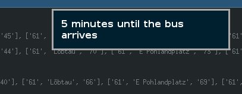

#catch-my-bus-python

A small GTK3 StatusIcon that displays the next Bus-Arrivals of a given station, which is pre-defined
in the fetch_station.py


###Installation

Clone the Git-Repo to your $HOME directory as follows:

```
git clone https://github.com/devmeepo/catch-my-bus-python ~/.catch-my-bus-python
```

You will need to have PyGObject installed, as well as Python 3.x.
For some reason this applet does not work with 

###Adding Bus-Stops

Just add the stop you want to the stop_list.txt file like this:

```
[City] -- [Bus-Stop]
```

Then simply restart the application.

###Getting notifications

If ```notify-send "[Notification message]"``` works for you, you can simply click
on a Bus in the menu, and 4 minutes before the bus arrives your notification-system
will display a small notification.

###Screenshots

Still under construction, but for a first view of what it looks like:




(This is what a notification with dunst could look like)

It should be the same thing as [kiliankoe/catchmybus](https://github.com/kiliankoe/catchmybus) for Linux.
(Or anyone who has PyGObject and Python 3.x installed)


Icon from [IconsDB](http://www.iconsdb.com/white-icons/train-icon.html)
