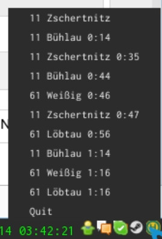

#catch-my-bus-python

A small GTK3 StatusIcon that displays the next Bus-Arrivals of a given station, which is pre-defined
in the fetch_station.py

###Installation

Clone the Git-Repo to your $HOME directory and rename it to ".catch-my-bus-python". Then simply run
the CatchMy.py script.

###Screenshot

Still under construction, but for a first view of what it looks like:

It should be the same thing as [kiliankoe/catchmybus](https://github.com/kiliankoe/catchmybus)