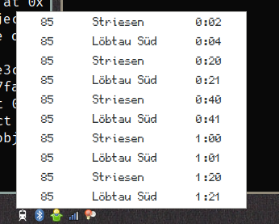
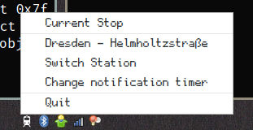

# catch-my-bus-python

A small GTK3 StatusIcon that displays the next Bus-Arrivals of a given station, which is pre-defined
in the fetch_station.py


### Installation

Clone the Git-Repo to your $HOME directory as follows:

```
git clone https://github.com/devmeepo/catch-my-bus-python ~/.catch-my-bus-python
```

You will need to have PyGObject installed, as well as Python 3.x.
For some reason this applet does not work with Unity. 

### Adding Bus-Stops

Just add the stop you want to the stop_list file like this:

```
[City] -- [Bus-Stop]
```

Then simply restart the application.

### Getting notifications

## !!!! NOTIFICATIONS CURRENTLY DO NOT WORK !!!!

You can set a notification time (from 1 to 30 minutes). If you click on a bus,
the notification will pop up n Minutes before your bus arrives (n being the time
you selected)

Notifications are handled via the notify2 library.

Simply use
```
pip install notify2
```
to install the library.

### Screenshots

Still under construction, but for a first view of what it looks like:






(This is what a notification with dunst could look like)

It should be the same thing as [kiliankoe/catchmybus](https://github.com/kiliankoe/catchmybus) for Linux.
(Or anyone who has PyGObject and Python 3.x installed)


Icon from [IconsDB](http://www.iconsdb.com/white-icons/train-icon.html)
