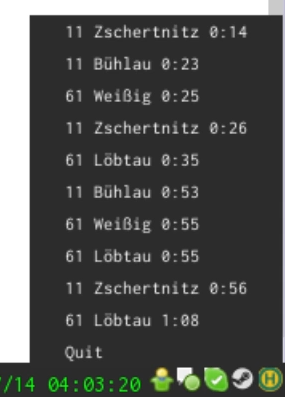

#catch-my-bus-python

A small GTK3 StatusIcon that displays the next Bus-Arrivals of a given station, which is pre-defined
in the fetch_station.py

###Installation

Clone the Git-Repo to your $HOME directory and rename it to ".catch-my-bus-python". Then simply run
the CatchMy.py script.

You will need to have PyGObject installed, as well as Python 3.x

###Changing the Bus-Stop

As of now, to change the bus stop you will have to modify the link in the fetch_station.py file as follows:

http://widgets.vvo-online.de/abfahrtsmonitor/Abfahrten.do?ort=Dresden&hst= {NAME OF MY STATION} &vz=

and simply hope that the results will be what you've wished for.

###Screenshot

Still under construction, but for a first view of what it looks like:

It should be the same thing as [kiliankoe/catchmybus](https://github.com/kiliankoe/catchmybus)